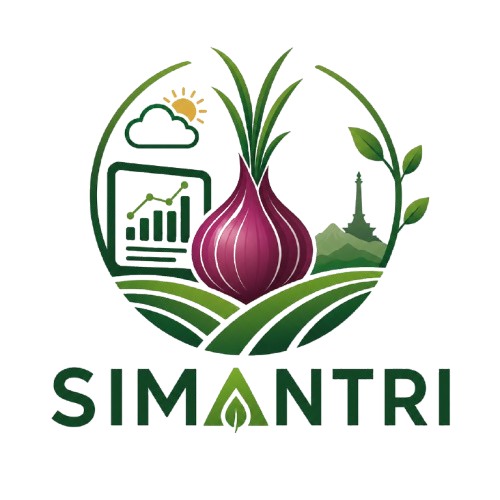

<div align="center">
  
  <h1>🌾 SIMANTRI</h1>
  <p><strong>Sistem Manajemen Tani Bawang Merah Nganjuk Berbasis Data & AI Terpercaya</strong></p>
  <p><em>NextGen Secure: Building the Future of Trusted Web Ecosystems</em></p>

  <p>
    <a href="#-tentang-simantri">Tentang</a> •
    <a href="#-fitur-utama">Fitur Utama</a> •
    <a href="#-arsitektur--teknologi">Arsitektur</a> •
    <a href="#-keamanan--tata-kelola-ekosistem">Keamanan</a> •
    <a href="#-panduan-instalasi-lokal">Instalasi</a> •
    <a href="#-kredensial-demo">Akun Demo</a>
  </p>
</div>

---

## 📖 Tentang SIMANTRI

**SIMANTRI (Sistem Manajemen Tani Bawang Merah Nganjuk)** adalah platform ekosistem pertanian cerdas yang dirancang khusus untuk memecahkan tantangan riil budidaya dan perdagangan bawang merah di Kabupaten Nganjuk, Jawa Timur.

Berbeda dari aplikasi umum yang mengandalkan data generik internet, SIMANTRI dibangun di atas **120+ butir basis pengetahuan terkurasi hasil wawancara mendalam dengan petani lokal berpengalaman** di Sukomoro, Rejoso, Bagor, dan sekitarnya. SIMANTRI mengintegrasikan model Machine Learning dan tata kelola data terverifikasi untuk menciptakan ekosistem rantai pasok dan budidaya yang adil dan berkelanjutan.

---

## ✨ Fitur Utama

```
┌────────────────────────────────────────────────────────────────────────┐
│                          EKOSISTEM SIMANTRI                            │
├───────────────────┬────────────────────┬───────────────────────────────┤
│   🤖 ASISTEN AI   │  🔬 DETEKSI DAUN   │      📈 PREDIKSI HARGA        │
│    (RAG Online)   │ (YOLOv8 CV Vision) │   (XGBoost Multi-Horizon)     │
├───────────────────┼────────────────────┼───────────────────────────────┤
│  🏛️ DOKUMENTASI   │  🛡️ ZERO-TRUST     │      🌐 DUNIA BRAMBANG        │
│   (Knowledge RAG) │  (KTA Penyuluh)    │   (Eksplorasi Interaktif 3D)  │
└───────────────────┴────────────────────┴───────────────────────────────┘
```

1. **🤖 AI Asisten Tani SIMA (Hybrid RAG + Citations)**
   - Asisten cerdas berbasis Retrieval-Augmented Generation (RAG) yang menjawab permasalahan fase tanam, pupuk, hama, dan cuaca.
   - Dilengkapi *chip kutipan dokumen terverifikasi* dan tombol umpan balik (*Helpful / Not Helpful*).

2. **🔬 Deteksi Dini Penyakit Daun (Computer Vision YOLOv8)**
   - Mengidentifikasi infeksi jamur berbahaya pada daun bawang merah: *Antraknosa (Otomatis), Moler / Layu Fusarium, dan Bercak Ungu (Trotol)*.
   - Menghasilkan visualisasi *bounding box*, skor keyakinan (*confidence*), serta protokol penanganan fungisida & sanitasi lahan.

3. **📈 Prakiraan Harga Panen Multihari (XGBoost Regressor)**
   - Model peramalan harga pasar komoditas Nganjuk untuk horizon **H+1, H+3, dan H+7**.
   - Menyajikan rekomendasi aksi cerdas (*Jual Segera, Tahan Panen, atau Jual Bertahap*) dilengkapi grafik tren historis.

4. **🛡️ Tata Kelola Identitas & Verifikasi Penyuluh (NextGen Secure)**
   - Memastikan integritas data lapangan dengan mewajibkan calon penyuluh mengunggah bukti dokumen SK/KTA Dinas.
   - Panel Verifikasi Admin untuk memvalidasi kredensial sebelum hak moderasi lapangan dibuka.

5. **🌐 Dunia Brambang (Pameran Budaya 3D Tani)**
   - Pengalaman visual imersif 3D Three.js untuk mengedukasi generasi muda tentang sejarah, varietas, dan siklus budidaya bawang merah Nganjuk.

---

## 🛠️ Arsitektur & Teknologi

- **Frontend & Fullstack Framework**: [Next.js 16.3.1](https://nextjs.org/) (App Router, Turbopack, React 19)
- **Styling**: Tailwind CSS + Custom SIMANTRI Design Tokens
- **Database & Auth**: [Supabase](https://supabase.com/) PostgreSQL + Row Level Security (RLS) + Database Triggers
- **AI & LLM Orchestration**: Google Gemini 2.5 API + In-Memory Vector & Keyword Hybrid Search
- **Machine Learning Sidecars**:
  - *Disease Detection*: YOLOv8 / PyTorch (FastAPI Sidecar + Client Inference Engine)
  - *Price Prediction*: XGBoost Regressor (Python FastAPI + Recursive Feature Lag Engine)
- **3D Visualization**: Three.js + GSAP ScrollTrigger + WebGL

---

## 🛡️ Keamanan & Tata Kelola Ekosistem (*Security by Design*)

Sistem keamanan SIMANTRI dirancang sesuai pilar *NextGen Secure*:

1. **Row Level Security (RLS)**: Setiap tabel database (`profiles`, `market_prices`, `feedback_history`, `knowledge_suggestions`) dilindungi kebijakan akses ketat per peran.
2. **Database Trigger Role Sanitization**: Mencegah eskalasi hak akses (*privilege escalation*); pendaftaran mandiri dibatasi hanya untuk `petani` dan `penyuluh (pending)`.
3. **Zero-Trust Contributor Verification**: Penyuluh wajib melalui audit dokumen KTA oleh Admin sebelum dapat mengesahkan data anomali atau rekomendasi budidaya.

---

## 🚀 Panduan Instalasi Lokal

### Prasyarat:
- Node.js versi 18.18+ atau 20+
- Akun Supabase (opsional jika menggunakan environment bawaan)

### Langkah-Langkah:

1. **Kloning Repositori**:
   ```bash
   git clone <URL_REPO_GITHUB_ANDA>
   cd SIMANTRI
   ```

2. **Instal Dependensi**:
   ```bash
   npm install
   ```

3. **Konfigurasi Environment (`.env.local`)**:
   Salin file `.env.example` menjadi `.env.local`:
   ```bash
   cp .env.example .env.local
   ```
   Pastikan variabel kunci berikut terisi:
   ```env
   NEXT_PUBLIC_SUPABASE_URL=https://giobbmjbykwqxzigmqzf.supabase.co
   NEXT_PUBLIC_SUPABASE_ANON_KEY=<SUPABASE_ANON_KEY>
   GEMINI_API_KEY=<GEMINI_API_KEY>
   ```

4. **Jalankan Server Pengembangan**:
   ```bash
   npm run dev
   ```
   Buka browser di: [http://localhost:3000](http://localhost:3000)

---

## 🔑 Akun Demo untuk Pengujian Cepat

Pada halaman login (`/login`), tersedia tombol 1-klik untuk masuk sebagai:

| Peran (Role) | Email | Kata Sandi | Hak Akses Utama |
|---|---|---|---|
| **Admin** | `admin.simantri@gmail.com` | `Simantri123!` | Input Harga Pasar, Moderasi Pengetahuan, Verifikasi KTA Penyuluh |
| **Penyuluh** | `penyuluh.simantri@gmail.com` | `Simantri123!` | Pemantauan Sinyal Penyakit Wilayah, Validasi Lapangan, Usulan |
| **Petani** | `petani.simantri@gmail.com` | `Simantri123!` | Tanya Asisten SIMA, Deteksi Daun, Prediksi Harga Panen, Usulan |

---

<div align="center">
  <p>© 2026 <strong>SIMANTRI</strong> — Memajukan Petani Bawang Merah Nganjuk dengan Sains, Data, dan Nilai Luhur Nusantara.</p>
</div>
