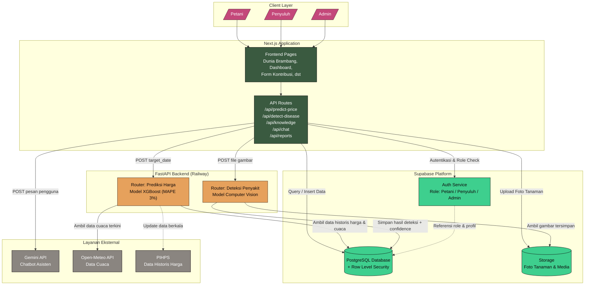

# Diagram Arsitektur Sistem - SIMANTRI

Source code Mermaid berikut bisa langsung dipakai di Mermaid Live Editor
(https://mermaid.live), VS Code (extension Mermaid Preview), atau tools lain
yang mendukung Mermaid.

## Penjelasan tiap layer

### 1. Client Layer
Tiga aktor (Petani, Penyuluh, Admin) mengakses sistem lewat browser, tidak
ada perbedaan platform teknis di layer ini — perbedaan akses ditentukan
oleh role yang tervalidasi di layer Supabase.

### 2. Next.js Application
Satu aplikasi menangani dua peran sekaligus: merender halaman (Frontend
Pages) dan menyediakan API Routes sebagai jembatan ke semua layanan
backend. Ini yang membuat client tidak pernah berkomunikasi langsung ke
Supabase service role, FastAPI, atau Gemini API — semua request disaring
lewat API Routes agar kredensial sensitif tidak pernah terekspos ke browser.

### 3. Supabase Platform
Tiga layanan berjalan bersamaan: Auth (identitas & role), Database dengan
Row Level Security (query hanya berhasil kalau role pengguna sesuai
kebijakan), dan Storage (untuk foto yang diupload saat fitur deteksi
penyakit dipakai).

### 4. FastAPI Backend (Railway)
Satu service, dua router terpisah secara kode (sesuai keputusan sebelumnya
untuk tidak memisah jadi microservices terpisah). Router prediksi harga
mengambil data historis dari Supabase dan data cuaca terkini dari
Open-Meteo untuk menyusun fitur sebelum memanggil model XGBoost. Router
deteksi penyakit mengambil gambar dari Storage sebelum diproses model CV.

### 5. Layanan Eksternal
Gemini API dipanggil langsung dari API Routes Next.js (bukan dari FastAPI)
karena sifatnya percakapan langsung, tidak butuh pemrosesan data tambahan.
Open-Meteo dipanggil real-time oleh router prediksi harga. PIHPS ditandai
dengan garis putus-putus karena sifatnya pembaruan data berkala (bukan
dipanggil di setiap request), berbeda dari Open-Meteo yang dipanggil
langsung saat prediksi diminta.
