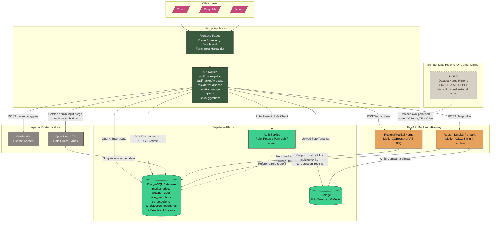

# Diagram Arsitektur Sistem - SIMANTRI (v2)

> Perubahan dari versi sebelumnya: PIHPS diklarifikasi sebagai sumber
> data historis untuk TRAINING MODEL (diambil manual sekali di awal,
> bukan koneksi live), karena PIHPS tidak menyediakan API publik
> (lihat `docs/product/PRD-Market.md`). Alur data harga harian yang
> sesungguhnya sekarang lewat Admin yang input manual ke `market_price`,
> yang lalu memicu fetch cuaca hari itu ke Open-Meteo.

## Penjelasan tiap layer

### 1. Client Layer
Tidak berubah — tiga aktor (Petani, Penyuluh, Admin) mengakses lewat
browser, perbedaan akses ditentukan role yang tervalidasi di Supabase.

### 2. Next.js Application
Sekarang API Routes mencantumkan `/api/market/price` dan
`/api/market/forecast` secara eksplisit, mengikuti kontrak di
`API_CONTRACT_v4.md`.

### 3. Supabase Platform
Database sekarang eksplisit mencantumkan tabel-tabel baru
(`market_price`, `weather_data`, `cv_detection_results`) supaya diagram
ini tetap akurat merepresentasikan skema v4.

### 4. FastAPI Backend (Railway)
Tidak berubah struktur, tapi CVRouter sekarang dicatat sebagai
"multi-deteksi" mengikuti temuan dari training batch YOLOv8.

### 5. Layanan Eksternal (Live) vs Sumber Data Historis (One-time)
**Ini perubahan paling penting.** Open-Meteo dan Gemini dipisah ke
kelompok "Live" karena memang dipanggil real-time saat dibutuhkan.
PIHPS dipisah ke kelompok tersendiri "Historical, One-time, Offline"
dengan gaya garis putus-putus dan warna berbeda (abu-abu, bukan warna
solid seperti komponen aktif lain), untuk menegaskan secara visual
bahwa PIHPS BUKAN bagian dari alur kerja sistem yang berjalan, itu
cuma sumber dataset yang dipakai sekali saat melatih model di masa
lalu. Kalau ada yang bertanya "kok PIHPS gak ada di alur utama",
jawabannya ada di diagram ini, karena memang tidak ada API resmi untuk
itu.

### 6. Alur Data Harga yang Sesungguhnya
Admin login → input harga hari ini lewat form → tersimpan ke
`market_price` → sistem otomatis fetch cuaca hari itu dari Open-Meteo
→ tersimpan ke `weather_data` → begitu ada permintaan prediksi,
PriceRouter mengambil gabungan riwayat `market_price` + `weather_data`
untuk menghitung fitur dan memanggil model.
